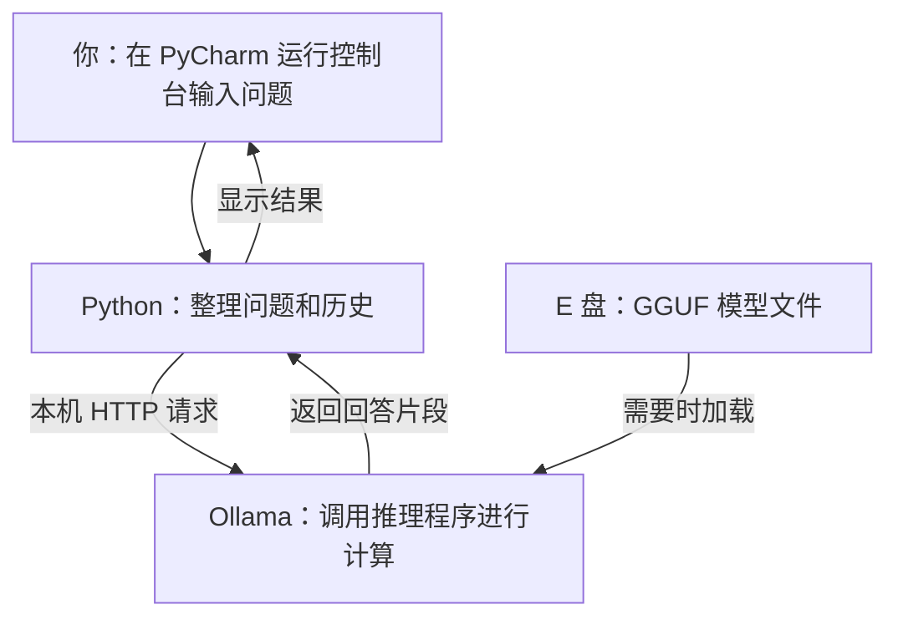

# 电脑端第 3 课：一次本地请求怎样完成

日期：2026-10-03。接着“模型下载到哪里、是什么格式”的问题，理解模型文件怎样被程序使用。
本课仍用 `scripts/chat-with-history.py`，不安装新软件，不改变已验证的聊天逻辑。
用户此前已报告 DeepSeek 名字回答错误；Qwen3 新配置经助手测试通过，但用户亲自重测的结果尚待反馈。

## 1. 这节只掌握三个问题

1. Python、Ollama 和模型文件分别负责什么？
2. 输入一句话后，请求如何到达模型并返回回答？
3. 为什么模型已下载，却可能没有加载在推理内存里？

目前正在做的是“使用已有模型构建本地应用”，不是从零训练模型。

## 2. 先把三种东西分开

### Python 代码：应用逻辑

`chat-with-history.py` 负责接收输入、整理历史、发送请求、显示回答和保存记录。
PyCharm 是编辑和启动这份代码的工具；实际执行 `.py` 文件的是 Python 解释器。
在当前实现中，Python 不直接读取那个 1.36 GB 的权重文件，也没有在这个脚本里实现大模型的矩阵计算。

### Ollama：管理模型并提供推理服务

Ollama 提供一个本机 HTTP 接口，接收 Python 请求，找到指定模型，并安排加载和生成。
底层推理程序按模型结构使用权重进行计算；当前课程请求配置 `num_gpu=0`，走 CPU 推理。
不要把 Ollama 服务本身与模型权重文件混为一谈：前者是运行中的软件，后者是软件读取的数据。

### GGUF 权重文件：模型的数据

此前已直接检查文件头：这个 Qwen3 权重文件为 GGUF 版本 3，量化类型 Q4_K_M。
文件包含权重以及模型相关信息，不能像 `.py` 或 `.exe` 那样直接双击执行问答。
它也不是一张事先写满“问题—答案”的表。回答是推理程序使用这些权重，结合本次输入逐步计算生成的。

模型文件位于：

```text
E:\Software\Ollama\models\blobs\sha256-3d0b790534fe4b79525fc3692950408dca41171676ed7e21db57af5c65ef6ab6
```

模型清单位于：

```text
E:\Software\Ollama\models\manifests\registry.ollama.ai\library\qwen3\1.7b
```

清单记录模型层、模板、参数等文件的摘要。Ollama 据此将 `qwen3:1.7b` 这个名称对应到实际文件。
因此 Python 只填写名称，不需要硬编码哈希文件路径。不要手工移动或重命名这些缓存文件。

## 3. 看懂调用关系



图中的请求与返回都发生在你这台电脑上。本课脚本调用的是本地已下载的 Qwen3，而不是云端模型服务。
HTTP 是通信方式，不等于一定访问互联网。这个判断针对当前代码，不代表电脑上其他软件都不联网。

## 4. 对照自己的代码，追踪一轮请求

打开 `scripts/chat-with-history.py`，先只找下面四处，不必一次看懂整个文件。

### 第一步：确定“去哪里”和“用哪个模型”

```python
MODEL = "qwen3:1.7b"
BASE_URL = "http://127.0.0.1:11434"
```

`MODEL` 是模型名称；`BASE_URL` 是服务地址，不是权重文件路径。
`127.0.0.1` 指当前电脑；`11434` 是本机服务端口。
之后拼接 `/api/chat`，就得到本课调用的聊天接口：

```text
http://127.0.0.1:11434/api/chat
```

可以把它理解为：在这台电脑上，找到 11434 号服务入口，使用它的聊天功能。
“接口”在这里不是物理插口，而是两个程序约定好的交互方式。

### 第二步：准备要发送的内容

```python
payload = {
    "model": MODEL,
    "messages": messages,
    "stream": True,
    "think": THINK,
    "keep_alive": "5m",
    "options": OPTIONS.copy(),
}
```

`payload` 是一个 Python 字典，意思是“这次请求携带的数据”。
其中 `messages` 是已经准备好的问题和历史；Python 不会把整个工程目录或模型权重塞进请求。
当前 `THINK=False` 表示请求 Qwen3 关闭独立思考生成，`stream=True` 表示逐步返回片段。

`keep_alive="5m"` 请求在完成后保留模型加载状态一段时间，便于随后复用；它不是保存聊天历史 5 分钟。
实际驻留还受服务调度、其他请求、资源情况或手动卸载影响，不能将其当成绝对保证。

### 第三步：把字典变成可发送的字节，再发出去

```python
request = Request(
    BASE_URL + "/api/chat",
    data=json.dumps(payload, ensure_ascii=False).encode("utf-8"),
    headers={"Content-Type": "application/json"},
    method="POST",
)
```

从内到外看这行转换：

1. `json.dumps(payload, ensure_ascii=False)`：把字典写成 JSON 文本，保留中文字符。
2. `.encode("utf-8")`：把文本变成可通过 HTTP 发送的字节。
3. `Content-Type` 告诉对方：请求正文是 JSON。
4. `POST` 是这次 HTTP 请求使用的方法。

注意：`Request(...)` 只是构造请求对象。真正开始连接和发送是在下面这一行：

```python
with CLIENT.open(request, timeout=180) as response:
```

`timeout=180` 是网络操作的超时设置，不是精确的整轮生成总时限，也不是要求模型必须思考 180 秒。

### 第四步：取出回答片段，边接收边显示

下面是摘取后的关键逻辑，不是一个可以单独运行的完整程序：

```python
for line in response:
    chunk = json.loads(line)
    message = chunk.get("message", {})
    content = message.get("content", "")
    print(content, end="", flush=True)
```

本课启用了流式返回，接收的是多行 JSON 数据，而不是一次 `json.load(response)` 读取整个回答。
`json.loads` 将一行 JSON 还原成 Python 对象；`message.content` 是该片段中的正式回答文字。
`end=""` 不在每个片段后换行；`flush=True` 让文字及时显示。
一个网络片段不必等于一个汉字或一个 token；不要用片段数量代替 token 数量。

完整代码还会跳过空行、检查错误与结束标记、拼接全部内容，并分别记录思考和正式回答的出现时间。
结束后，程序把完整正式回答加入当前 Python 历史列表，并保存本轮 JSON 实验记录。
保存实验记录不会修改 GGUF 模型权重。

参考：[Ollama Chat API 的字段与响应说明](https://docs.ollama.com/api/chat)。

## 5. 已下载，不等于已加载

本节助手做了两个只读检查，2026-10-03 检查当时：

- `ollama list`：列出了 `qwen3:1.7b` 和 `deepseek-r1:1.5b`。
- `ollama ps`：只有表头，没有列出模型。

两项结果不矛盾：

- `list` 问的是“本机有哪些模型条目”，本课这两个条目都有本地下载文件。
- `ps` 问的是“服务当前有哪些已加载的模型”，不表示它们每一刻都在计算。
- 模型从推理运行时卸载，不等于硬盘上的文件被删除；之后可再从本地加载，无需重新下载。

这里的“没有加载”是 Ollama 运行状态，不宣称操作系统一定已经清空所有文件缓存。
这个检查只代表当时状态；你运行聊天后再查看，结果可能不同。

参考：[Ollama 命令行说明](https://docs.ollama.com/cli)。

## 6. 自己做一个不改代码的小练习

### A. 先看磁盘上有没有模型

打开 PyCharm 的 **Terminal / 终端** 标签，而不是正在等待“你：”输入的 Run 控制台。
本课按 PowerShell 终端写命令：

```powershell
& 'E:\Software\Ollama\ollama.exe' list
& 'E:\Software\Ollama\ollama.exe' ps
```

前面的 `&` 表示执行后面的程序路径。两条分别运行即可，都不会触发下载或生成回答。
如果 `ps` 没有列出模型，也不一定是错误。

### B. 发起一次真实聊天

右键运行 `scripts/chat-with-history.py`，确认顶部为 Qwen3 且思考生成关闭。
在 **Run / 运行** 控制台输入：

```text
1加1等于几？请只回答数字。
```

等回答完成，再回到 **Terminal / 终端**，立即运行：

```powershell
& 'E:\Software\Ollama\ollama.exe' ps
```

通常能看到 Qwen3 已加载。这个输出也可帮助核对本次运行使用的处理器和上下文等信息。
如果没有看到，先检查请求是否成功、是否过去了很长时间、有无其他调度，不要立即重复下载。
本节没有由助手替你执行这条新问题；最终答案、耗时和 ps 状态以你实际运行结果为准。

### C. 回到代码，指出两行

找到：

```python
request = Request(...)
with CLIENT.open(request, timeout=180) as response:
```

能够说出“第一行准备请求，第二行才发送”，就比只会点击 Run 更进一步了。

## 7. 检查自己是否理解

假设 GGUF 文件还在 E 盘，但 Ollama 服务没有启动，当前 Python 聊天脚本能否得到模型回答？为什么？

可以先自己回答，再核对：不能。这个脚本通过 HTTP 调用 Ollama，不是直接读取 GGUF 并在 Python 内执行推理。
没有服务监听相应地址时，会发生连接失败；文件仍在并不能代替服务运行。

另一种开发方式确实可以让 Python 程序借助推理库直接加载 GGUF，但那是不同架构，不是改一个 BASE_URL 就能做到。
本课暂不引入这条新路线，也不安装额外包。

## 下一步

完成这节后，再学习 `num_ctx`、`num_predict` 和 `temperature` 各控制什么。
届时只改变一个参数、保留原始结果，避免同时改模型和多个参数后无法判断原因。
